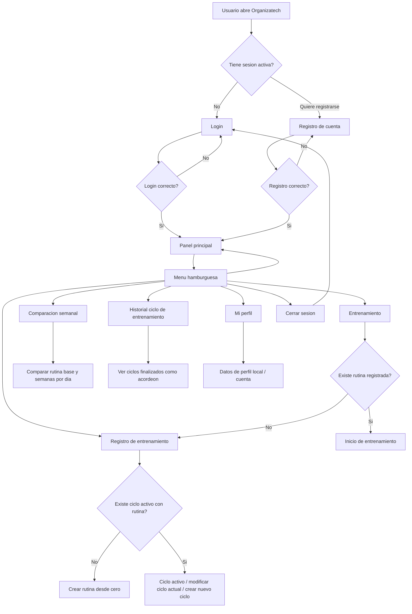
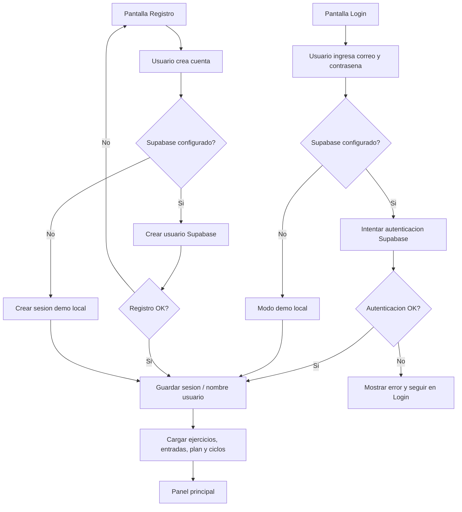
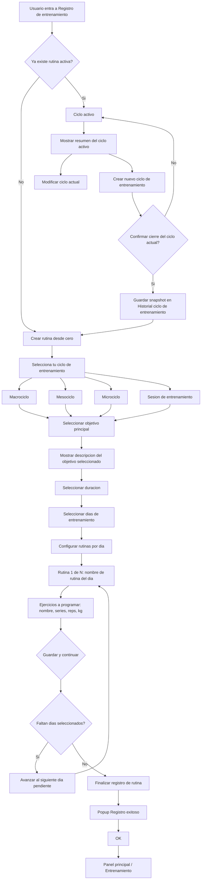
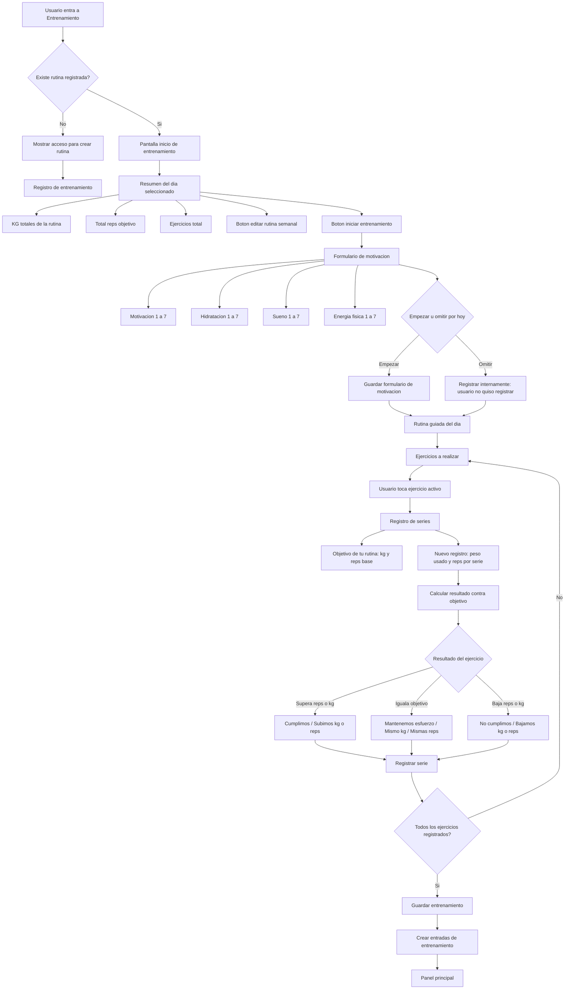
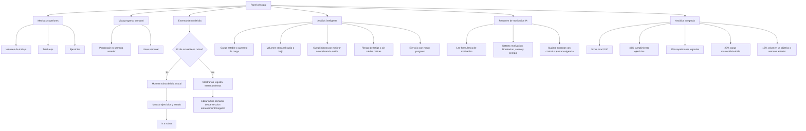
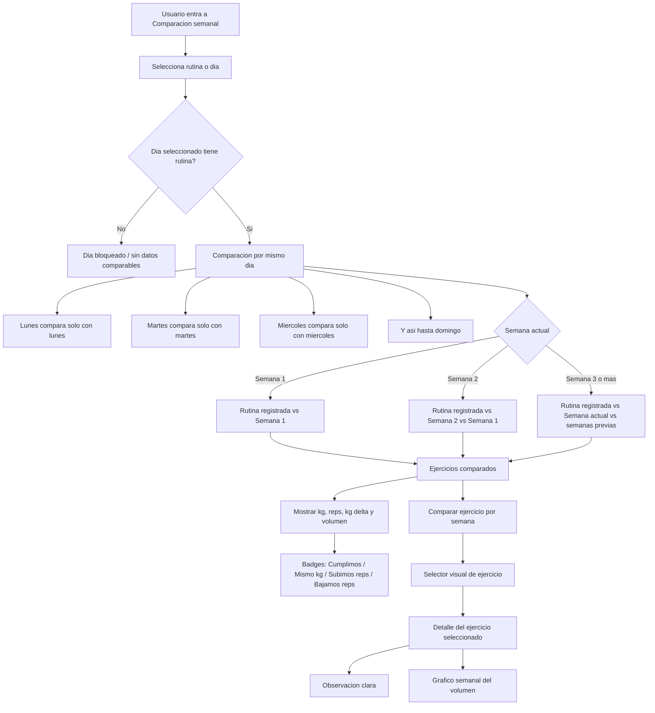
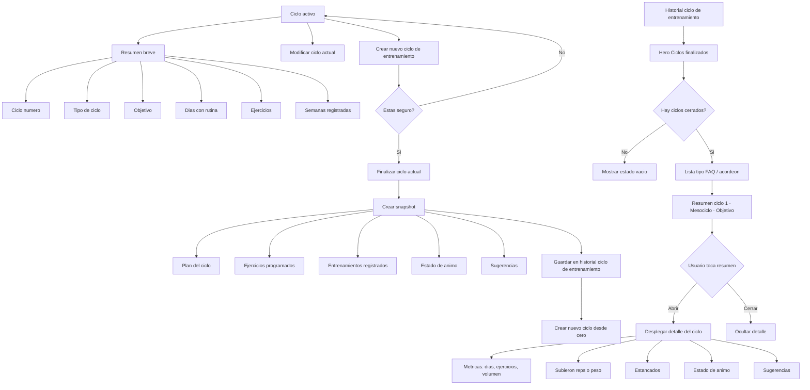
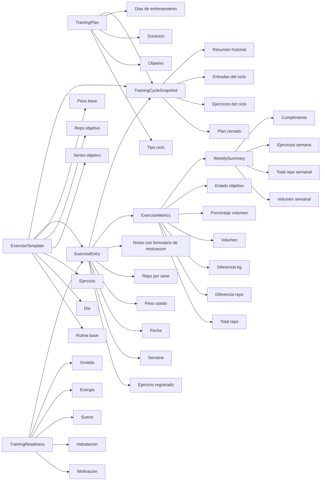
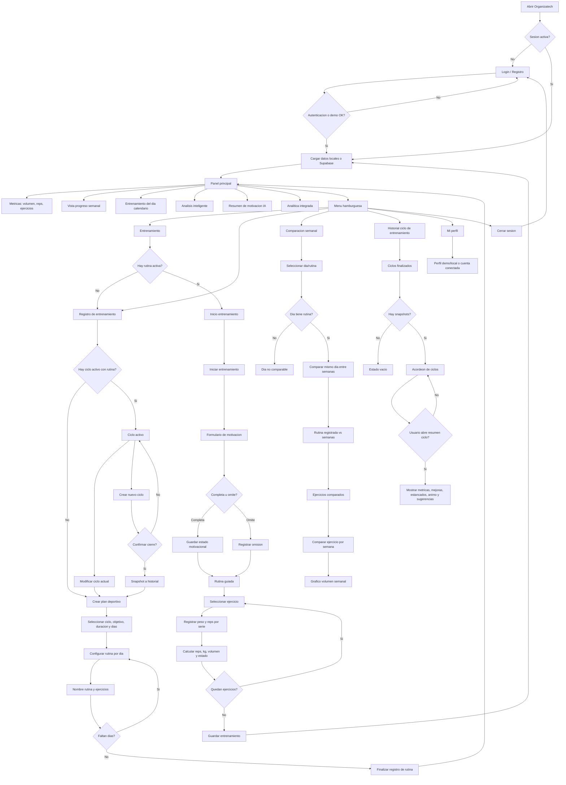

# Organizatech - Flujo actual de la app

Documento visual del flujo funcional actual de Organizatech. Los bloques estan escritos en Mermaid para que GitHub y editores compatibles los muestren como diagramas.

## 1. Mapa general de navegacion

## 2. Login, registro y persistencia

## 3. Registro de entrenamiento / creacion de rutina

## 4. Entrenamiento diario

## 5. Panel principal

## 6. Comparacion semanal

## 7. Ciclos e historial

## 8. Modelo de datos y calculos

### Decisiones funcionales actuales

| Area | Decision actual |
| --- | --- |
| Rutina base | El usuario programa dias, ejercicios, series, repeticiones y kg antes de entrenar. |
| Dias | Solo se muestran los dias con rutina registrada; maximo lunes a domingo. |
| Entrenamiento del dia | El panel principal usa el dia calendario actual y muestra rutina solo si ese dia existe. |
| Registro de ejercicio | El usuario selecciona ejercicio desde la lista y registra peso usado y reps por serie. |
| Comparacion inicial | En semana inicial se compara contra el objetivo base. Si iguala objetivo, se mantiene; no se marca como progreso falso. |
| Comparacion semanal | Se compara siempre por dia equivalente: lunes con lunes, martes con martes, etc. |
| Volumen | Se calcula como peso usado por total de repeticiones registradas. |
| KG totales de rutina | Se interpreta como suma de pesos base por ejercicio programado, no peso por reps. |
| Formulario de motivacion | Puede completarse u omitirse; si se omite queda registrado internamente. |
| Analitica integrada | Score ponderado: 40% cumplimiento, 25% reps, 20% carga, 15% volumen. |
| Ciclos | Al crear un nuevo ciclo se finaliza el actual y se guarda un snapshot en historial. |
| Historial de ciclos | Se muestra como acordeon tipo pregunta frecuente para evitar scroll infinito. |

## 9. Diagrama general completo

